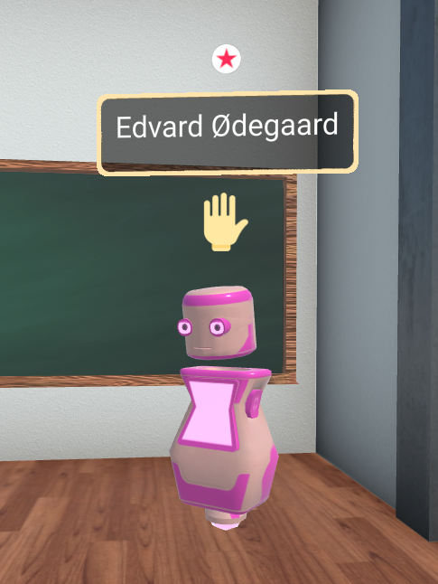

# Communication

### Positional Audio
Voice communication (through your microphone) is the primary form of communication inside a virtual classroom. Just like in real life, the distance between you and other avatars will affect how well you can hear them. If you get closer to others, their audio will become louder.  If you move farther away, you won’t be able to hear them.

You can use this feature to create breakout groups or you can spread out to have one on one conversations.

### Chat
You can also communicate with others via in-room messages. Click the ‘Chat’ button in the upper right hand corner.  Your message will appear to everyone in the room.

### Raise Hand
You can raise your hand to get other people's attention. Click the Raise Hand button and a hand icon will appear above your avatar’s head.

