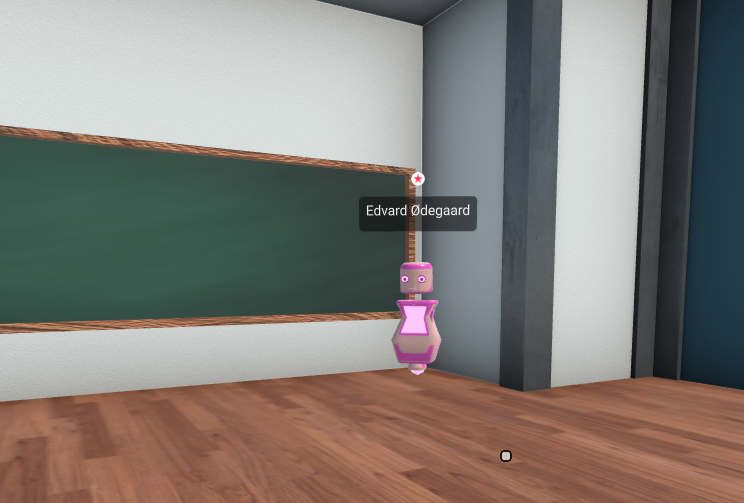

import ReactPlayer from 'react-player'

# Avatar and Movement Basics

Review the basics of how to teach and learn on the MegaMinds platform.

## Avatars

### What is an avatar?
An **avatar** is a 3D figure representing a particular person in a classroom. 
When entering a classroom, you will select an avatar from our repository and this is how other users will see you in a virtual room.

*In this picture Edvard is represented as a pink robot inside a room. He can move around and talk to others*

### Moving your avatar
Once you have entered the room, you can move the position of your avatar by pressing and holding the following keys:

|Key |Description|
|:-:	|:-:	|
| **W** | Move Forwards |
| **A** | Move Left |
| **S** | Move Backwards |
| **D** | Move Right |

Alternatively, you can use the ARROW KEYS to move around.  

### Looking Around / Rotating

Moving only gets you strafing around. To actually rotate your avatar head, **click and drag** the left mouse button anywhere in the 3D context.

### Video tutorial
Watch Eric explain Movement and Rotation
<ReactPlayer controls url='https://youtu.be/z_WaiB4TOuA' />

