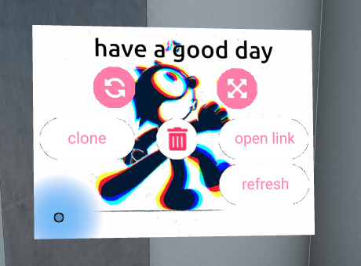

# Object Controls

Controls for any objects (3D models, videos, GIFs, etc.) can be found in the Object Menu. 
To reveal the Object Menu, hover your cursor over the object and press the spacebar.

Once revealed, you may perform actions such as rotation, scaling, creating clones (copies) of the object, etc.
