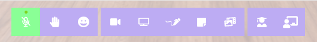
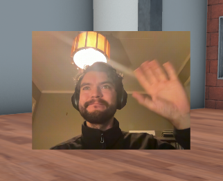
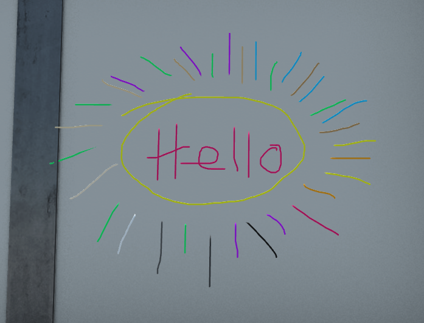
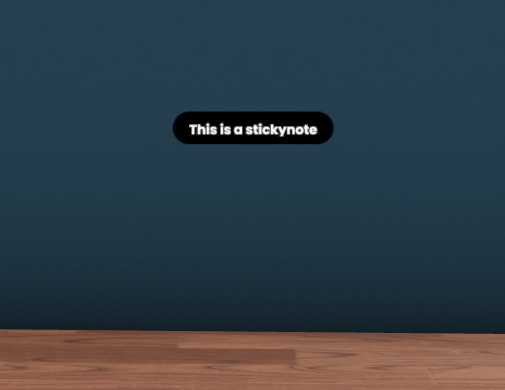

# User Interface & Tools

## Toolbar

Entering the room will give you a toolbar / button row on the center bottom of your screen. 

They are categorized into three groups: Communication, Media & Collaboration, Management and Admin tools

### Button Explaination

#### 1. Microphone Mute / Unmute
Toggle the mute status of your microphone on and off

#### 2. Hand Raise / Lower
Toggle the hand raised status
 
#### 3. Reactions
Clicking this button opens the Reaction menu with available reactions that you can perform.

Clicking on one of the available reacitons will create a visual fanfare of particles and the selected reaction emoji in front of your avatar that users can see. 

#### 4. Share Camera
Allows you to share your webcam into the room as an object. It will look something like this:

Other users will be able to see your camera feed. You can move your camera object anywhere in the room.

#### 5. Share Screen
Same concept as above, you can share your screen as an object in the room that other users can see.
Useful for running Kahoot or sharing a working document.

#### 6. Pen tool

The Pen tool allows you to tempoarilly draw on surfaces in a room.
Once you leave the room, pen markings will dissapear.

There are some useful shortcuts for advanced use (only when the Pen Tool is active)

|Key |Description|
|:-:	|:-:	|
| **SHIFT** + **Q** | Cycle pen color backwards |
| **SHIFT** + **E** | Cycle pen color forwards |
| **SHIFT** + **Mouse Scroll-Wheel** | (Mouse) Change pen size |
| **SHIFT** + **Two-finger up/down motion** | (Touchpad) Change pen size |
| **CMD** + **Z** | (Mac keyboard) Undo last stroke |
| **ALT** + **Z** | (Windows keyboard) Undo last stroke |

#### 7. Sticky Note

A sticky note is a basic text component that lets users add text as 3D objects in the room.

#### 8. Add Media

Add various media to the room, useful if you have something you want to temporarilly drop into the classroom without making permanent through the Classroom Editor.

#### 9. Student Tools

In this menu you will find tools that the students can use while in a classroom.

Currently, the following tools are available:

##### Image Submission

Students can take a screenshot and capture evidence of their work through the Submit Picture button.  The results are stored in the Teacher Dashboard.

#### 10. Teacher Tools
In this menu you will find tools that are useful for the teacher while in a classroom.

Currently, the following tools are available:

##### Gather
Teleport all students in a classroom to your position.

##### Teleport
Teleport all students to a specific location in the classroom.
