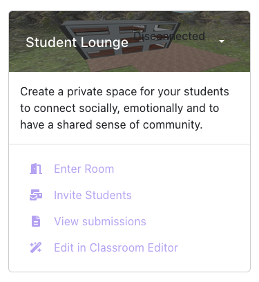
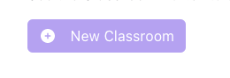
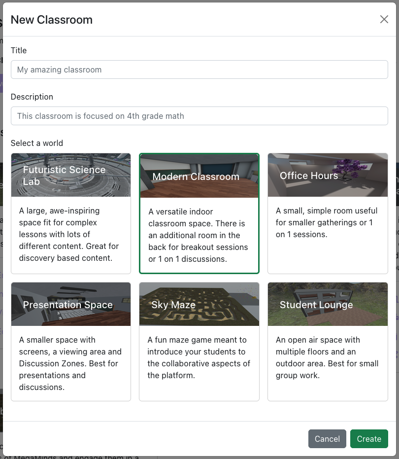

# Classrooms

The **Classrooms tab** is where you can list, edit and create new virtual classrooms for your students to explore.

## What is a classroom

A classroom is a virtual 3D environment where teachers, students (and technically any other user you would like to invite) can participate as avatars.

Once a classroom is created, it is listed on your Classrooms page and can be accessed 24/7 - making them suitable for both in-class activity, virtual lessons, and homework assignment.

It is up to the teacher to decide how the classroom is used. If the classroom will be used asynchronously (let students participate without intervention, for example through exploring), teachers can fill it with assignments and exploratory content, or for synchronous useage (where a teacher for example does a live lecture with their students), place relevant content and presentations in the 3D world.

For more information about potential use cases and applications, check out our [Teacher Hub](https://www.notion.so/Teacher-Hub-9a92e4b85edf4a14adec4f65bd40ba44)

In the dashboard, your classrooms are represented with a card that looks like this:

### Button Explaination

#### Enter Room
This button opens a new page where you can access your virtual classroom.

#### Invite Students
This button opens a menu where you can copy the link to the virtual classroom.
Share the link to your students (via email or an LMS like Google Classroom) and they can join the virtual classroom simply by clicking on the link.

#### View Submissions
This button opens a menu where you can see the submissions that have been submitted from inside this classroom.
For example by [submitting a screenshot from this classroom](placeholder) or [filling out a question component](placeholder) that the teacher placed in the [Classroom Editor](placeholder).

#### Edit in Classroom Editor
Edit in Classroom Editor will open the Classroom Editor where you can edit and create content, assignments and various other components to your classroom. 

For more information about the Classroom Editor, check out [this page](placeholder)

## Creating new classrooms
1. Use the ‘New Classroom’ button on top of the page.

2. Chose a **title**, **description** and [**world**](worlds "Worlds are empty 3D models that act as the basis for your classroom") for your classroom. 

*The title will be visible to anyone who enters the classroom, while the description is used as an internal reference for you and will show up only in the dashboard.*

3. Click the "Create" button and your classroom will show up in the list of classrooms.

## Editing your classroom 

You can edit your classroom by clicking the "Edit in Classroom Editor" button.

[Learn more about using the Classroom Editor here](../editor.md)

