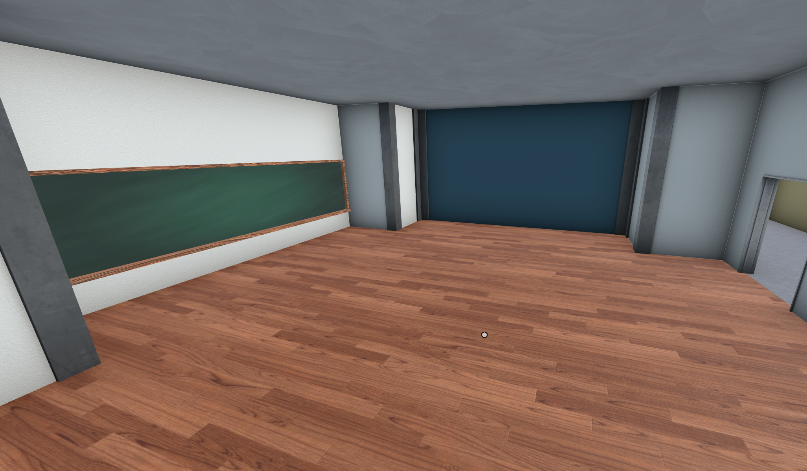
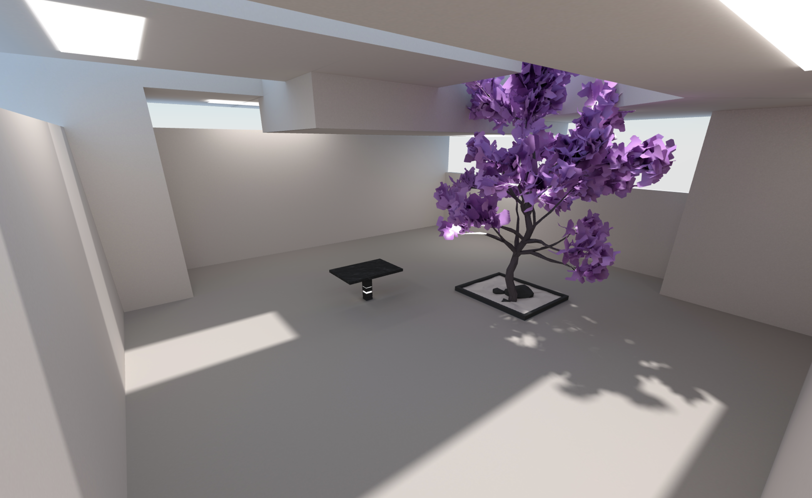
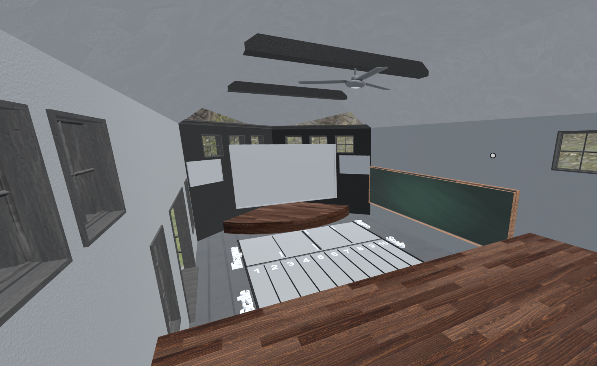
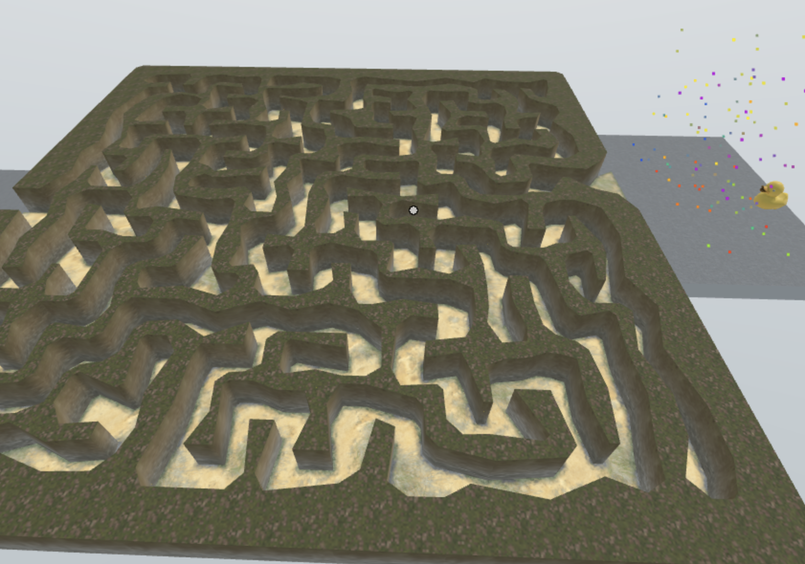

# Worlds

Worlds are the base 3D models that you will select from to create your virtual classrooms. We will be releasing more Worlds in future updates that are themed around different subjects and activities.

# Currently available worlds

### Futuristic Science Lab

A large, awe-inspiring space fit for complex lessons with lots of different content. Great for discovery based content.

### Modern Classroom

A versatile indoor classroom space. There is an additional room in the back for breakout sessions or 1 on 1 discussions.

### Office Hours

A small, simple room useful for smaller gatherings or 1 on 1 sessions.

### Presentation Space

A smaller space with screens, a viewing area and Discussion Zones. Best for presentations and discussions.

### Sky Maze

A fun maze game meant to introduce your students to the collaborative aspects of the platform.

### Student Lounge

An open air space with multiple floors and an outdoor area. Best for small group work.
