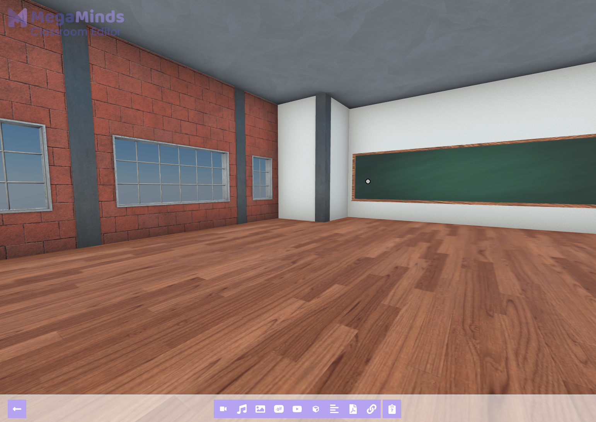

# Introduction

## Before we start creating

If you did not already, it might be useful that you familiarize yourself with the [concept of classrooms](/docs/dashboard/classrooms) before using the editor.

## Role of Classroom Editor

Adding content and customizing your classrooms all happen in the Classroom Editor. All new classrooms start off empty, and is the blank canvas for you to start shaping the classroom that your students will experience.

The Classroom Editor simply put allows you to add content and a variety of useful components to your classroom.

## How do I use the Classroom Editor?

We highly recommend you try the [Building your first Virtual Classroom](/hub/dashboard/first-classroom) guide and exploring other content in the [Teacher Hub](/hub/intro)!

Also check out the complete [Component Overview](tool-overview) to see all the different types of content you can place in your classrooms!
