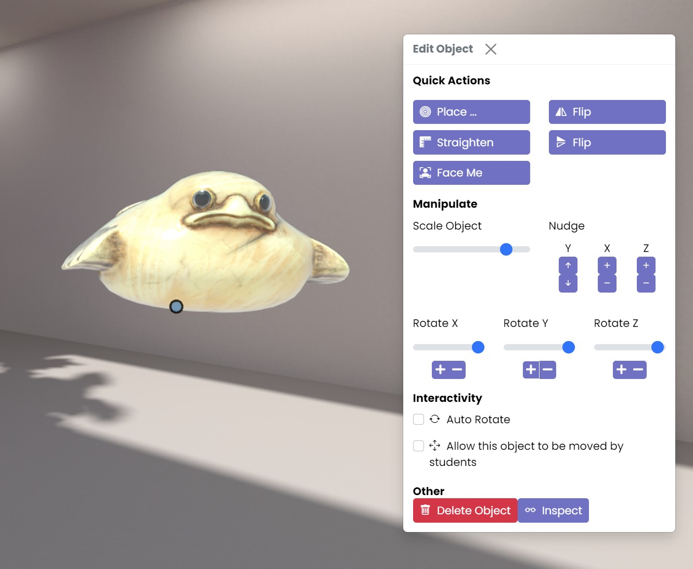

# The Object Menu

On this page you will find an overview of how to use the Object Menu to accurately position and edit all of your content in your virtual classroom.

To open the object menu, simply right click on an object.

### Quick Actions

#### Place
This button will allow you to place your object on any wall in your virtual classroom. It will reveal a sub menu where you can select the exact placement.

#### Straighten
This button will automatically straighten the object vertically.

#### Face Me
The Face Me button will angle the object towards your avatar, no matter where it is in the classroom.

#### Flips
The Flip buttons will flip the object vertically or horizontally.

### Manipulate
Here you can control the scale and rotation of your object through the sliders and buttons.  Because we are manipulating objects in 3D space, you can control them across the x, y and z axis. 

The Nudge controls allow you to finetune your object’s positioning.

### Interactivity
Clicking the Auto Rotate box will rotate your object 360 degrees.  You can control the speed of it’s rotation through the slider.

Every object you place in the classroom is automatically locked and cannot be manipulated by students unless you check the ‘Allow this object to be moved by students’ box.  This will allow the object to be manipulated by students during your class session.

### Other

#### Inspect
The Inspect button will focus your camera and pan it to an object, giving you a 360 degree view of your object.

#### Delete
The Delete button will remove the object permanently from the room.

