# Components

On this page you will find a complete overview and pictures of every single component we have available in a classroom.

We will use the same order as on the toolbar in the Classroom Editor:
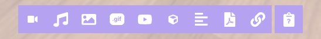

## Video

The Video Component will display video content inside the room. It acts as a flat plane object that can be moved, rotated, and scaled.
If the video file contains audio, this will also be audible to users that are close to the video in the room.

Video Components are networked, meaning that its play/pause state is shared with all users in the room. This makes watching content together as groups an easy task.

_A video component with the controls **Skip Backwards**, **Pause**, **Skip Forward**, Reload (in case the video does not load properly)_

:::tip Supported Formats

**.mp4** **.mov** **.webm**

:::

:::note Accessibility

Be mindful of users that are connecting to the room with mobile devices, or otherwise less than ideal network conditions. Large video files may cause them to use unneccessary bandwidth over cellular data, or take a long time to load.

We recommend keeping the total combined filesize of all videos in a room to no more than 30 megabytes to ensure compatibility for all. If you know your students will be connecting from laptops, school network, or other stable and equal environment, feel free to experiment with more video content.

:::

## Audio

The Audio Component will play audio when users are nearby its position in the room.
It is represented as a 2D plane with a music note icon so that it can grabbed and positioned, as well as provide controls such as play, pause, volume up, down, etc.

Audio Components are networked, meaning that its play/pause state is shared with all users in the room. This makes listening to audio together as groups an easy task.

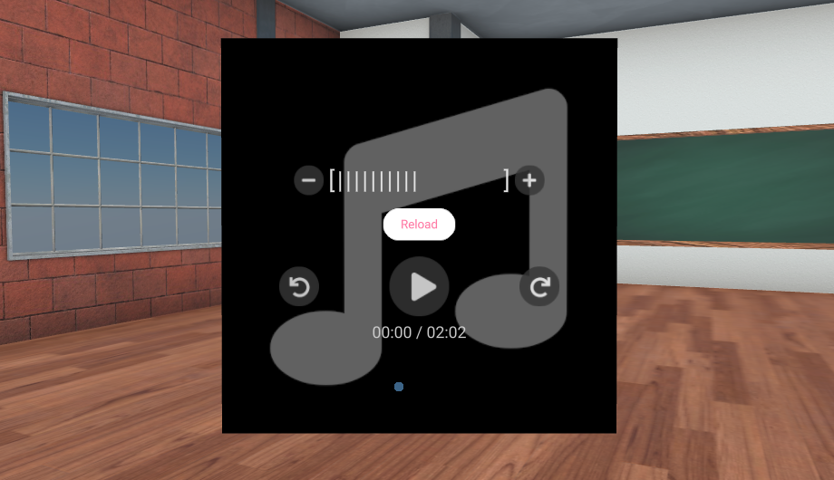
:::tip Supported Formats

**.mp3** **.aac** **.flac** **.m4a** **.wav** **.opus**

:::

:::note Accessibility

A lot of audio components in the room may cause an overwhelming feeling for students. To keep your room accessible and user friendly, avoid placing audio around the starting area of a room.

:::

## Images

The Image Component will display an image inside the classroom on a 2D plane. It does not feature any buttons such as on the Video and Audio components.
It can be scaled, rotated, and positioned anywhere in the room.

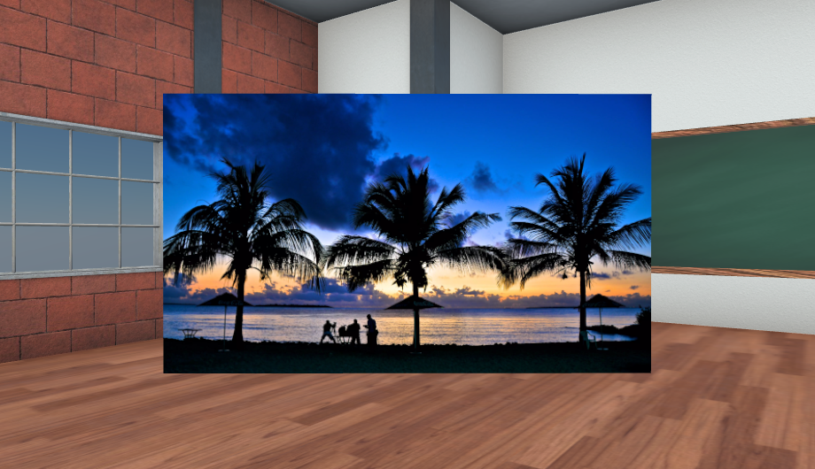

:::tip Supported Formats

**.bmp** **.jpg** **.jpeg** **.svg (with transparency)** **.png** **.webp** **.gif**

:::

## Gifs

The Gif Component will display an image with in the filetype **.gif** inside the classroom on a 2D plane. Some GIFs are still, while some contain motion. If a GIF image you upload is a moving ("like a video") GIF, it will feature the same controls as the Video Component.

It can be scaled, rotated, and positioned anywhere in the room.

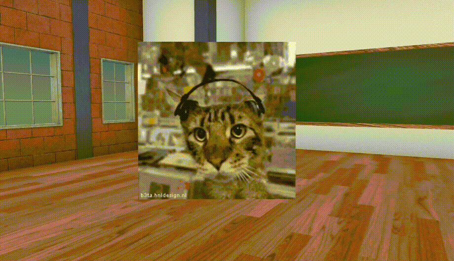

:::tip Browse Gifs

Click "Add Gif" from the toolbar and then "Find Gifs" to open the Gif browser. Here you can directly search and import 3D models into the Classroom Editor from thousands of gifs provided through Tenor.

:::

## Youtube

The Youtube Component acts exactly the same as the [Video Component.](#video), except that it uses a Youtube.com links as its source.

## 3D Models

3D Models can be placed in the room. They can be scaled, rotated, and positioned.

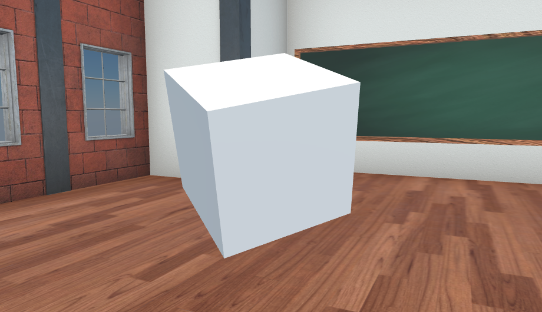

:::tip Supported Formats

**.glb** **.gltf**

:::

:::tip Browse 3D Models

We have integrated our platform with 3D Model libraries. Click "Add 3D Model" and then "Search" to open the 3D model browser. Here you can directly search and import 3D models into the Classroom Editor.

:::

## Text

The Text Component is used to place 2D text in your classroom. This is a very flexible tool.

You can change color and the text can be scaled, rotated and placed anywhere in the room. Use scaling to make the text bigger and smaller.

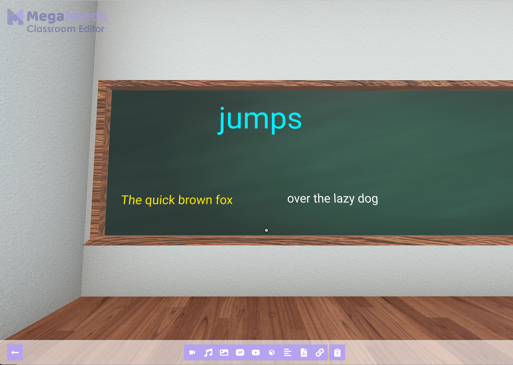
_In this example we created three separate text components in different colors to emphasize the different parts of the sentence. The word "jumps" is moved up and scaled to be bigger than the other text._

## PDF Documents

PDF Documents can be placed in a classroom. They can be scaled, rotated and placed anywhere in the classroom.

PDF Documents have controls to navigate to next and previous pages.

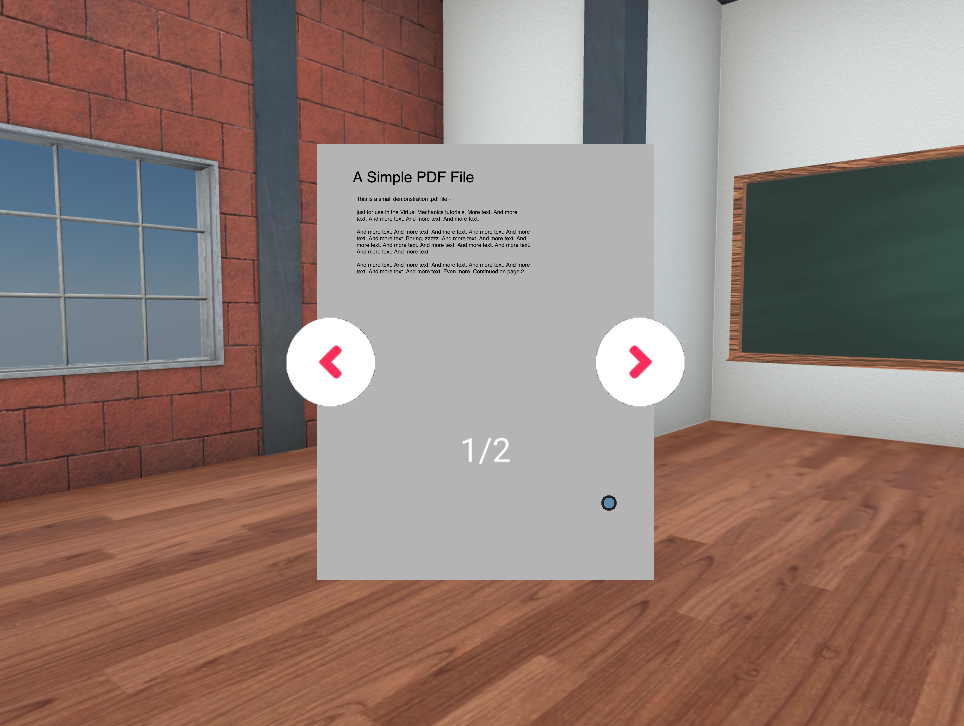

:::tip Supported Formats

**.pdf**

Remember that you can **convert almost any document format to PDF** and then use it in MegaMinds! For example saving/exporting your **PowerPoint** slides, **Microsoft Word** Documents, **Google Sheets** or **Excel Spreadsheet** to PDF.

:::

## Links

The Link Component is used to refer students to external websites from inside the room. A preview of the website will be shown, and users can click the "Open Link" button.

You can link to any website, including other EduTech platforms, Google Sheets, etc. See [third party assessments](/hub/dashboard/tips#you-can-use-3rd-party-assessment-tools-too) for some inspiration.

Clicking the "Open Link" button will open the link in a new tab, keeping the MegaMinds window open.

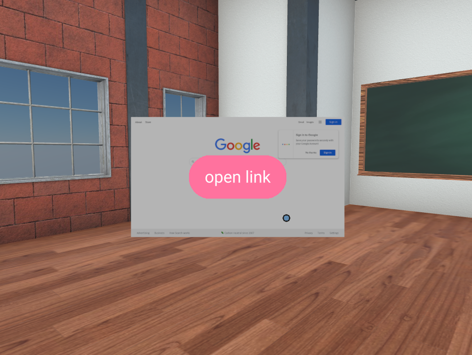

## Student Input

The Student Input Component will display a survey that students can fill out when nearby this component. The component uses a red questionmark to signal that there is a SStudent Input Form at its location.

### Creating a Student Input Component

When creating a Student Input Component, the teacher (you!) is able to write down a set of questions that the students will fill out and submit.

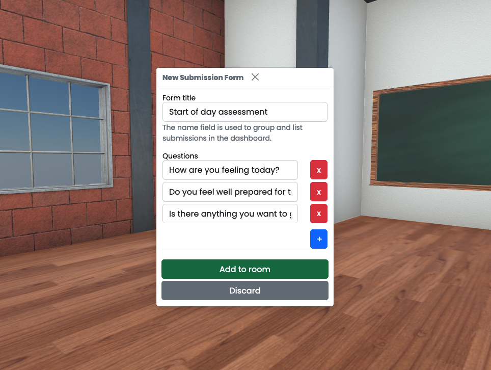

After creating the form you want the students to reply to, click "Add to Room" button to place it in the room.

### Placing a Student Input Component

A 3D model of a red questionmark will be used as a guide to place this form in the 3D Classroom.

Click and drag the questionmark to position the Student Input box. If you dont want to click through the preview box, move a littlebit back.

The preview box is there to differenciate when using multiple Student Input Components close by, and to give you a feeling of the placement and distance to the box pop up trigger.

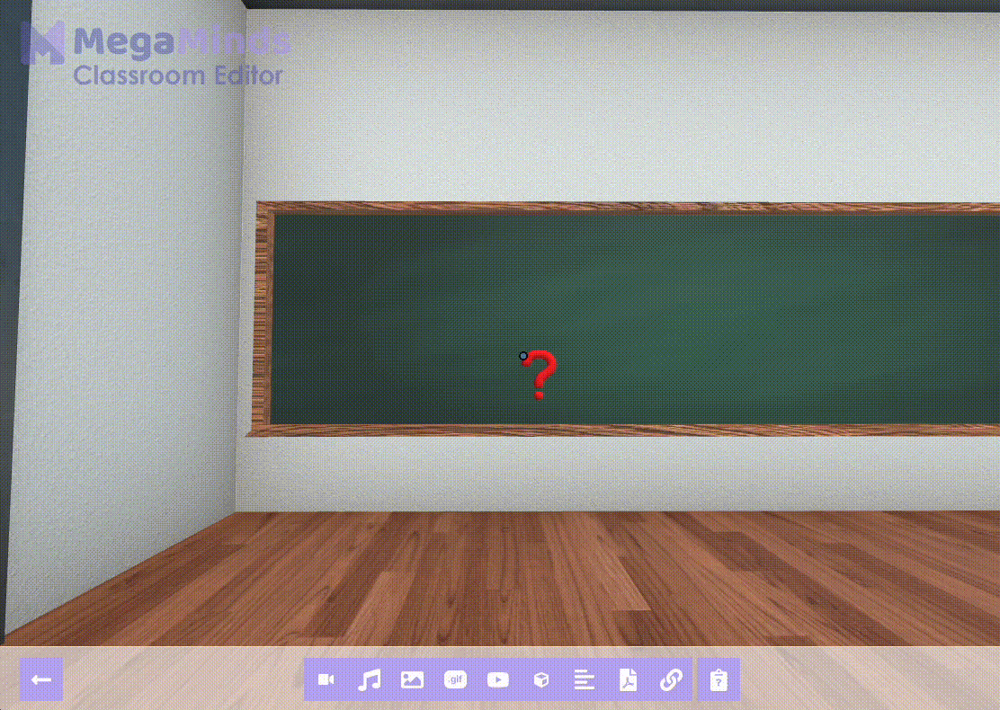

:::caution Note

You may not submit a Student Input Component from inside the Classroom Editor. Go back to the dashboard, open the room by clicking "Enter Room" to see the final result.

:::

### Submitting and Viewing Submissions

Students will see the full opacity box and can fill out the questions. This is how it looks for students outside Classroom Editor:

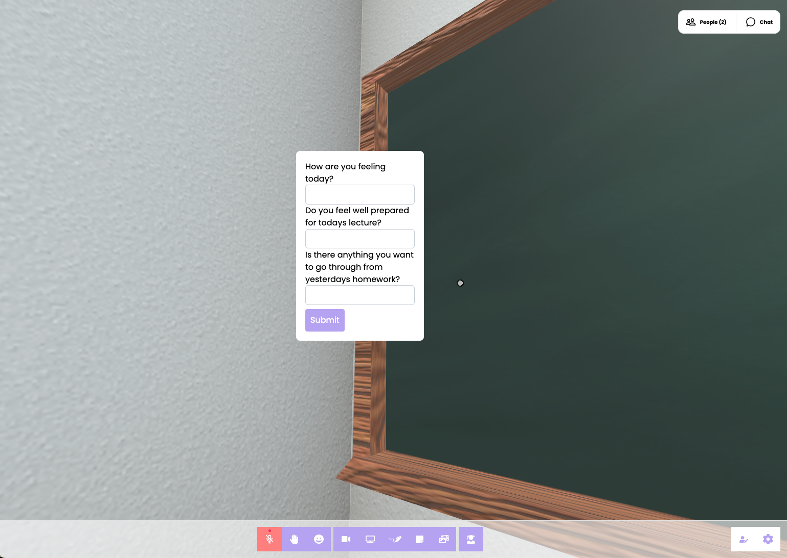

You can view submissions in the Dashboard -> Classrooms -> View Submissions.
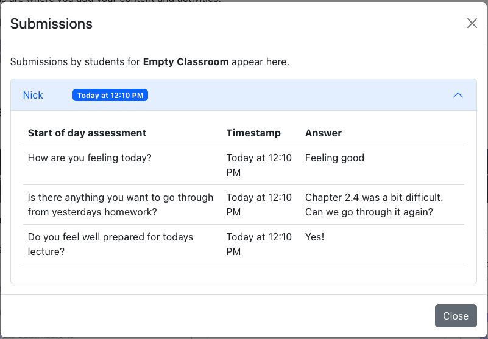

