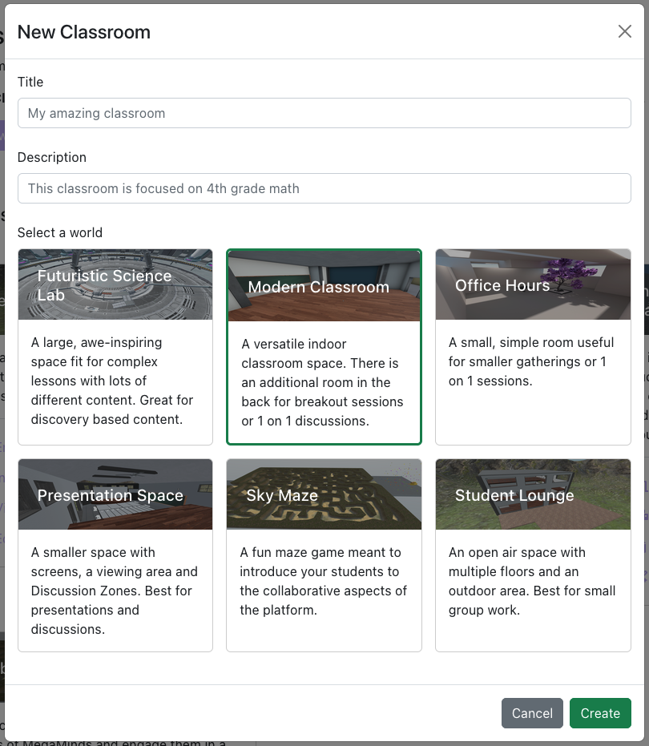
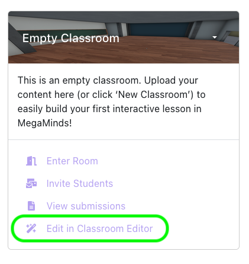
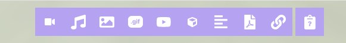
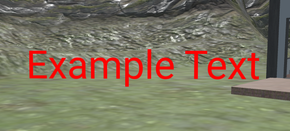
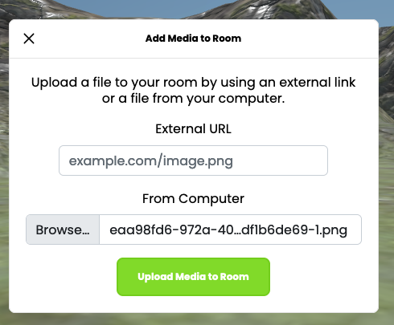
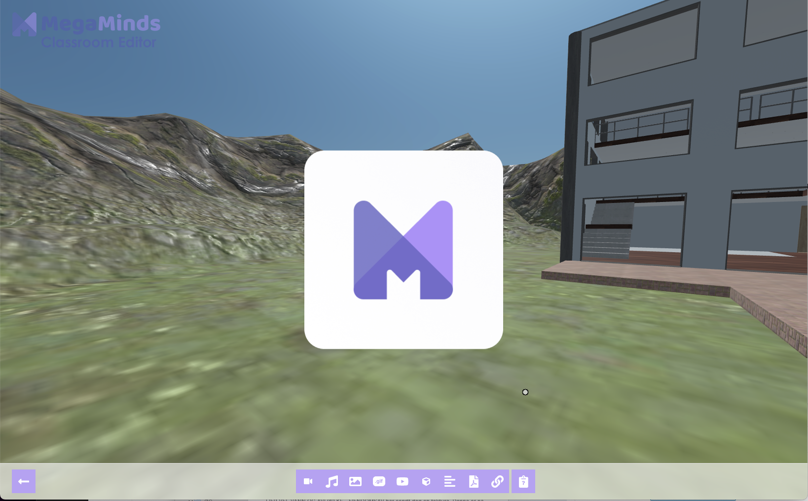
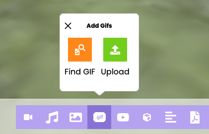
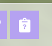
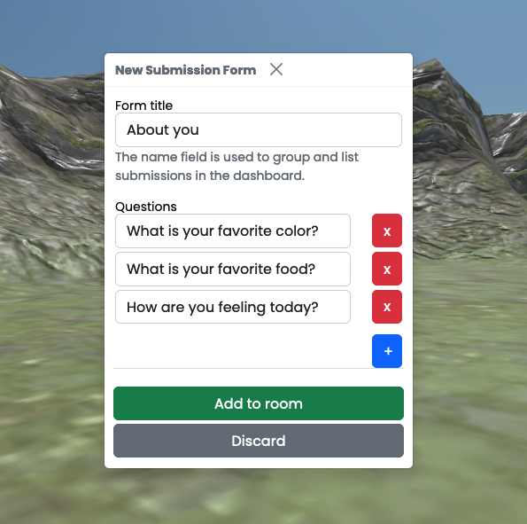
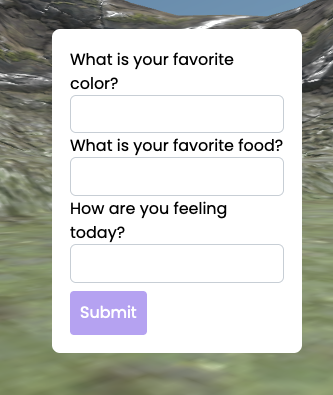

import ReactPlayer from 'react-player'

# 1. Building Your First Virtual Classroom

## Creating a Classroom

From the Teacher Dashboard, click on the "Classrooms" button from the sidebar.

Click the "Create a new classroom" with a name, description, and world you would like.

## Editing your new classroom

After creating a classroom, it is your tabula rasa ready to be filled with content, assignments and experiences.
To start editing your new empty classroom, click the "Open in Classroom Editor" button from the dashboard.

Once entered, you will notice the toolbar on the bottom of the screen. This is your go-to menu to start adding content.

There are a lot of different types of content and components to place in a room. We recommend you try out the **Text** and **Images** components first to get familiar with content placement and creation.

For a full in-depth overview of all the different components, check out the [Classroom Editor Documentation](/docs/editor)

### Adding a text component to your room

1. Click the "Text" button on the bottom toolbar
2. A "Preview" should appear in front of you, as well as a popup box on the left side of the browser window.
3. Write your text in the textbox, and optionally select a different color for your text. In this example we have chosen red.
4. Click "Create"
5. The text component will appear in front of you and is now part of the room.

:::tip

The text box supports multiple lines. You can hit "enter" to start a new line.

:::

### Uploading an image to your room

1. Click the "Add Images" button on the bottom toolbar
2. Click "Upload"
3. Browse for the image you want by clicking "Browse..."
4. Click "Upload Media to Room"
5. The image will appear in front of you

:::tip

You can also drag-and-drop pictures, PDF documents, and other files straight from your desktop into the MegaMinds website.

:::

*In this example we uploaded a white and purple MegaMinds logo icon to the room.*

### Moving the text and image around

Simply click and drag the image to move it around in the room.

Click and hold while using the movement keys to move it together with your avatar over greater distances. For more information about avatar movement and navigation, please check out [Avatar and Movement Basics](/docs/3d/intro) in our Documentation pages.

### How to Import Your Own Content

While in the Classroom Editor, you can import all of the content you typically use to teach your lesson, including photos, videos, PDFs, GIFs and more. You can even import 3D models.

You add media by dragging and dropping a file into the room or using one of the buttons on the toolbar to browse and upload it into the room.

URLs to any website, including other edtech programs, can also be added to your worlds by using the "Link" button.

### How To Find Content

Aside from using your own content described above, you can also search for **3D Models** and **Gifs** directly in MegaMinds Classroom Editor. We plan to add more ways to find and explore content in the future.

For example, there is a "Find GIF" button under "Add Gifs":

### How To Manipulate And Place Content

After you’ve imported your content, you can control the size and rotation of your content and place them in specific areas of your Classroom. The controls for objects, videos, and drawings can be found in their object menus. To reveal these controls, hover your cursor over the object and press the spacebar or tab key on your keyboard.

<ReactPlayer controls url='https://www.youtube.com/watch?v=DszcAv18XaU&feature=emb_title' />

## Student Assessment

Lets get some feedback from the students. We will use the Student Input Component (also known as the Question Component) to place a survey/form inside the room that students can fill out. 

1. Click the "Student Input" button that looks like this 

2. Create some questions that you want the students to reply to. These can be for example an assessment of the students mood today (How are you feeling), or something specific for the classroom you are creating (Who was the first person on the moon).

In this example we opt for something simple, like assessing a students favorite color, food and how they are feeling today.

After clicking "Add to Room", a red questionmark will show up and display a popup with the questions.
In order to move the survey around and place it in the room, you can click and drag the red question mark around.

When students fill out a Student Input Component, their answers will show up in the Dashboard under "View Submissions".

:::info

While inside the Classroom Editor, you may not submit a response to the Student Submission component.

You can use this feature to create asynchronous experiences where students go through a room and answer multiple Student Input components. 

This is how it looks when using the room as normal (outside Classroom Editor):

:::

## Congratulations!

You have now created some basic components to your classrooms. Try to upload and create some fun classrooms and invite your students in.
