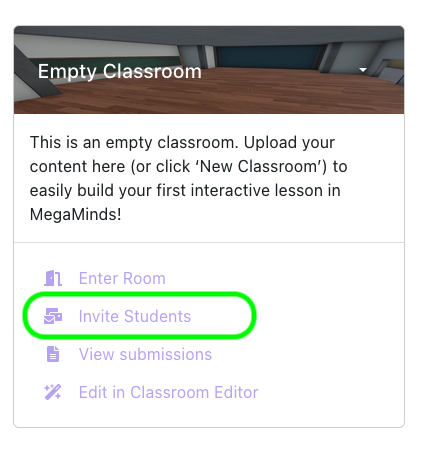
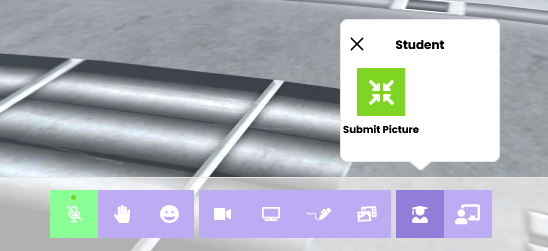
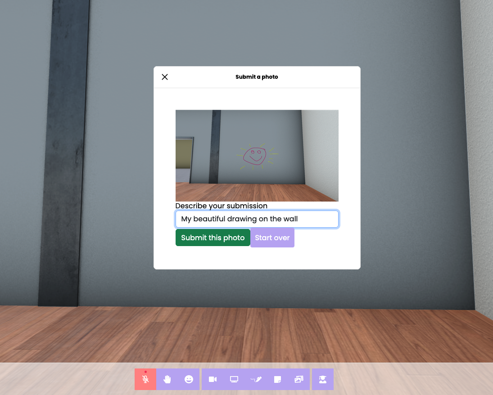
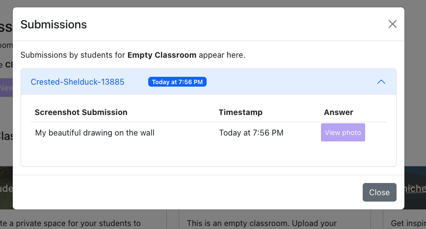
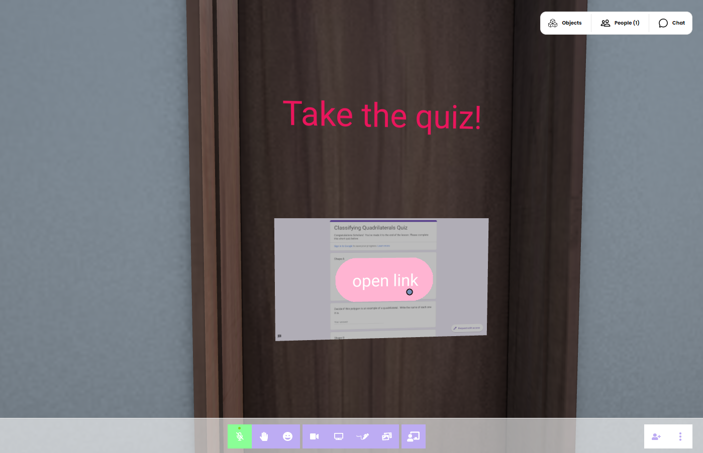

# 2. Assign and Review Student Work

Now that you’ve finished building your sparkling new interactive virtual Classroom, you need to assign it to your students to use.

## Inviting Your Students

Now you just need to invite your students.

Head back into your dashboard and click on Classrooms. Find your new Classroom and click on **Invite Students**.

Copy the URL to your clipboard, and send the link through email or Google Classroom or whatever LMS you’re using.

If you’re using your Classroom synchronously in-class, just click “Enter Room” and you’ll be able to join your students!

If you’re using your Classroom asynchronously, you’ve already done all you need to do! Just give your students a time to join your world together if you want them to work through it collaboratively. And if not, simply let them enter the world whenever they wish and work through your lesson at their own pace.

## Capturing and Reviewing Student Work

### Using screenshots

You can ask your students to complete assignments and do activities in your Classrooms. For instance, you may ask them to show you three examples of photosynthetic organisms, and they would use the ‘**add media’** button to search for 3D models or add their own examples.

Capturing the work your students do inside the room is easy. Your students simply need to click the ‘**Student’** button and take a screen shot of their work to illustrate their comprehension. They will fill out the ‘Describe your work’ fields in the box, and click ‘Submit.”

You will receive their submission in your Sessions tab. Just click ‘**View submissions’** in the Dashboard for the Classroom that you are using, and you’ll find their work there.

### Using the Student Input Component

We added and explained the Student Input component in the previous part of this guide [Building your first Virtual Classroom](first-classroom)

### You Can Use 3rd Party Assessment Tools Too

You can also use the Link Component to add third party assessment tools like Google Forms or any other edtech program you may use.  It will open up in a new tab in your student’s browser, and they can complete the assessment there.

